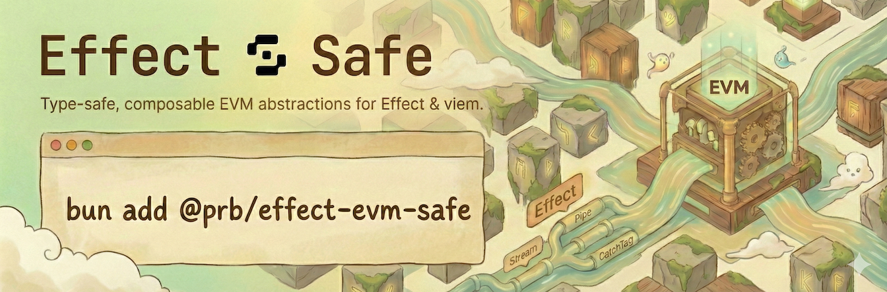

# @prb/effect-evm-safe

[](../LICENSE)
[](https://effect.website)

> [!WARNING]
>
> This is experimental, beta software. It is provided "as is" without warranty of any kind, express or implied.

Safe Apps + Safe multisig utilities for Effect, built on top of `@prb/effect-evm`.



## Installation

```bash
bun add @prb/effect-evm-safe @prb/effect-evm @safe-global/safe-apps-sdk
```

Peer dependencies

- `effect@^4.0.0`
- `@prb/effect-evm@^5.0.0`
- `@safe-global/safe-apps-sdk@9.1.0`
- `viem@^2.43`
- Optional: `@wagmi/core@>=2.0.0` (for hooks using wagmi)
- Optional: `wagmi@^2.19.5` (for hooks using wagmi)
- Optional: `react@>=18.2.0`, `react-dom@>=18.2.0` (for React hooks)

## Usage

```typescript
import { Layer } from "effect";
import { makeEffectEvmLayer } from "@prb/effect-evm";
import { SafeAppsServiceLive } from "@prb/effect-evm-safe";

const baseLayer = makeEffectEvmLayer(/* chain configs */, window.ethereum);
const layer = Layer.provideMerge(SafeAppsServiceLive(), baseLayer);
```

## Migration to v6 (Effect 4)

Upgrade `effect` to `^4.0.0` and `@prb/effect-evm` to `^5.0.0` together. The Safe services are native `Context.Service`
classes; mock layers can still use `Layer.succeed(SafeAppsService, SafeAppsService.of({...}))`. Custom service keys use
`Context.Service<MyService, MyServiceShape>()("MyService")`, and service shapes are available through
`typeof SafeAppsService.Service` or `Context.Service.Shape<typeof SafeAppsService>`.

Use `Effect.result` to inspect expected failures. `Result` uses `Success.success` and `Failure.failure`:

```typescript
import { Effect } from "effect";
import { SafeAppsService } from "@prb/effect-evm-safe";

const program = Effect.gen(function* () {
  const safe = yield* SafeAppsService;
  return yield* safe.getInfo();
});
const result = await Effect.runPromise(program.pipe(Effect.result, Effect.provide(layer)));
if (result._tag === "Failure") console.error(result.failure.message);
else console.log(result.success.safeAddress);
```

For a previously captured runtime, use a service context with `Effect.runPromiseWith(context)(program)` or
`Effect.runForkWith(context)(program)`. React runtimes from `@prb/effect-evm` expose `.context`; their bound runners
remain available. Tagged Safe errors retain `Schema.TaggedError` and can be recovered with `Effect.catchTag`. Simulation
error bigint fields still encode as decimal strings through `Schema.BigIntFromString`.

Keep `safeWriteAndTrack` and pipeline adapter executions inside the owning `Effect.scoped` lifetime. Observe state with
`SubscriptionRef.changes(handle.stateRef)`, and await `handle.result` (or the adapter's `terminal`) before closing that
scope. Closing it interrupts pending terminal waiters. Queued and cancelled results, receipt-based success and revert
detection, retryable lookup failures, progress callbacks, and the total `maxWait` budget retain their behavior.

Tests import `TestClock` from `effect/testing/TestClock` and use `Effect.forkChild` or `Effect.forkScoped`; forked
workers start on the scheduler, so coordinate registration before sending test callbacks.

## Exports

- Safe Apps service: `SafeAppsService`, `SafeAppsServiceLive`
- Safe detection: `isSafeMultisig`
- Safe simulation: `SafeMultisigSimulationService`, `SafeMultisigSimulationServiceLive`
- Types + errors: `safe/*`
- React hooks: `@prb/effect-evm-safe/react-hooks`

### Safe Apps SDK routing

`useWalletExecution` separates Safe wallet detection from Safe Apps SDK execution capability:

```tsx
import { useWalletExecution } from "@prb/effect-evm-safe/react-hooks";

function CreateButton() {
  const execution = useWalletExecution();

  if (execution.walletType === "safe-multisig" && !execution.canUseSafeAppsSdk) {
    return <button disabled>Open in Safe</button>;
  }

  return <button>Create</button>;
}
```

A Safe multisig detected through a connector or owners probe can still be running in a normal browser tab. Use
`canUseSafeAppsSdk` or `safeAppsExecution.available` before calling Safe Apps SDK submission methods.

## Contributing

For package-specific commands and conventions, see [AGENTS.md](./AGENTS.md).

## License

MIT
